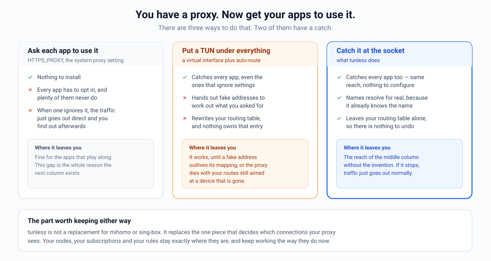
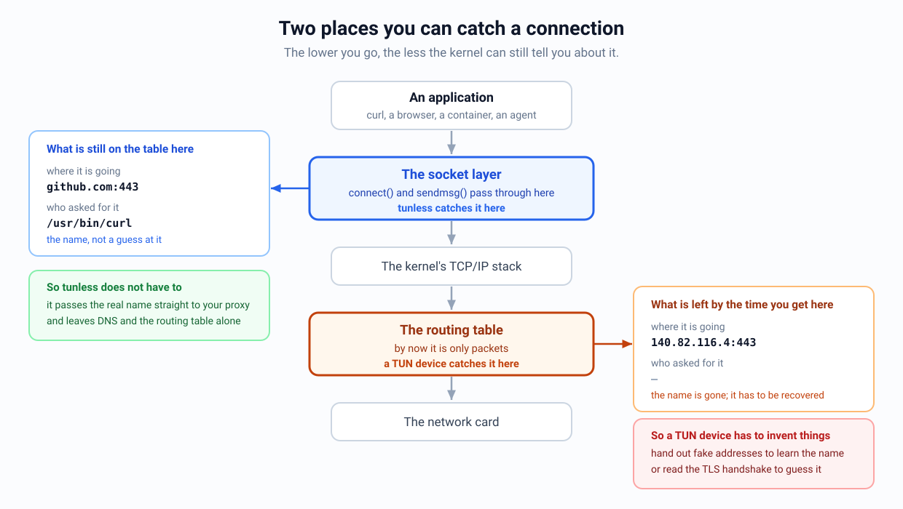
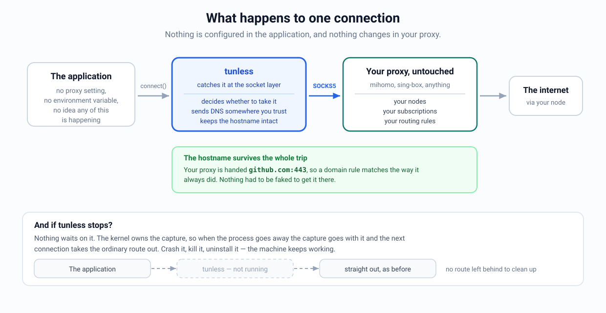

<p align="center">
  
</p>

<h1 align="center">tunless</h1>

<p align="center">
  <strong>TUN-less transparent proxying. No fake IP, no route hijack, no second TCP stack.</strong>
</p>

<p align="center">
  <a href="https://github.com/bojieli/tunless/actions/workflows/ci.yml"></a>
  <a href="LICENSE"></a>
</p>

You already run mihomo or sing-box. The nodes work, the rules are tuned, the
subscription updates itself. The annoying part is getting your applications to
actually use any of it.

Some of them read `HTTPS_PROXY`. Plenty never look, and those go straight out
without telling you. So you turn on TUN mode, because it catches everything —
and now your resolver hands out addresses from `198.18.0.0/15` that mean nothing
to anyone but the proxy that minted them, your routing table has been rewritten
by something that cannot put it back, and if that process dies you find out by
losing the network.

`tunless` is the third option. It catches connections one layer higher, at the
socket, before they have turned into packets. Up there the kernel still knows
the hostname the application asked for and which program asked, so there is
nothing to reconstruct and nothing to fake. It hands what it catches to the
proxy you already run, as ordinary SOCKS5.

<p align="center">
  
</p>

## Why one layer higher changes everything

A TUN device is handed packets. By that point the name you typed is gone — all
that is left is an address and a port. But your proxy's rules are written about
names, so the name has to come back somehow, and there are only two ways to do
that. Either answer DNS with a made-up address and remember which name you gave
it out for, or read the TLS handshake on the way past and hope the hostname is
still in the clear.

Both work most of the time. Both also explain the failures people actually hit:
a made-up address that outlives the mapping behind it connects fine and then
transfers nothing, and encrypted client hello is quietly removing the second
option.

At the socket layer none of that is necessary, because nothing has been thrown
away yet.

<p align="center">
  
</p>

That is the whole idea. The rest follows from it:

- Names resolve to real addresses, so nothing leaks a fake one into a cache, a
  log, or an application that checks its own DNS.
- The routing table is never touched, so there is nothing to roll back and
  nothing left pointing at a device that no longer exists.
- Flows stay on the kernel's own sockets. There is no second TCP/IP stack in
  userspace reimplementing what the kernel already does.
- If `tunless` stops, connections go out the normal way. The kernel owns the
  capture, so killing the process releases it. We test that with `SIGKILL`
  rather than claiming it.
- Your proxy keeps its job. `tunless` replaces the inbound, not the rules.

If you want the longer argument, including what was rejected and why, that is
in [BLUEPRINT.md](BLUEPRINT.md).

## How it works

<p align="center">
  
</p>

An application calls `connect()` the way it always has. The capture point lives
inside the operating system's own socket layer — eBPF cgroup hooks on Linux, a
Network Extension on macOS, WFP on Windows — so the flow arrives with its real
destination and its calling process still attached. `tunless` decides whether
to take it, sends port-53 traffic to a resolver you chose, and emits the rest as
plain SOCKS5. Your proxy sees a normal SOCKS5 client.

| Platform | How it captures | Where it stands |
| --- | --- | --- |
| Linux | eBPF cgroup connect/sendmsg/recvmsg and sockops | TCP and UDP over both address families, on the host and inside container namespaces. Unconnected UDP is single-destination on purpose; see the note under [migration](#migrate-from-mihomo-tun). |
| macOS | `NETransparentProxyProvider` system extension | Notarized builds pass the recorded live suites, and capture stands aside on its own if the upstream stops resolving. Clean-machine qualification of the exact candidate is still open. |
| Windows | WFP ALE connect-redirect callout | Source only. The driver has never been built by a WDK, loaded, or run under Driver Verifier, and it is not signed. Treat it as a design, not a download. |

The three platforms ship at different maturities and the first release says so
on its face: **Linux is generally available, macOS is beta, and Windows is
source only.** See
[what the first release covers](docs/RELEASING.md#what-the-first-release-covers).

The portable core does the SOCKS5 work for all three: TCP and UDP emission,
HTTP CONNECT and SOCKS5 reference inbounds, capture filters, a DNS observer that
watches real answers, and two optional ways to pass process identity downstream.

Capture costs about a quarter of a percent of throughput. On a steady link,
112.82 MB/s captured against 113.13 MB/s direct, at 1.35 CPU-seconds and about
10 MB of memory per gigabyte relayed. Every number in this repository is written
down with the machine and the date it came from, in
[measurements and release gates](docs/MEASUREMENTS.md).

## Quick start (Linux)

You need cgroup v2, kernel 5.7 or newer, and enough privilege to load and attach
BPF programs. Kernels 5.10, 6.1 and 6.8 have all been through the verifier and
the live runtime suite here.

```console
make
sudo make install
sudo systemctl enable --now tunless
```

The installed unit reads `/etc/tunless.env` if present and defaults to:

```ini
TUNLESS_UPSTREAM=127.0.0.1:7890
TUNLESS_CGROUP=/sys/fs/cgroup/user.slice
TUNLESS_DNS_UPSTREAM=1.1.1.1:53
```

Packages install this optional environment file as root-owned mode `0600`
because an upstream URL may contain SOCKS credentials.

Run mihomo or sing-box as a system service, outside `user.slice`. The `tunless`
unit lives in `system.slice` for the same reason. This is not an exception list
you have to maintain — it is just keeping the proxy out of the scope that gets
captured, so its own outbound connections do not come straight back to it.

For an isolated scope or development test:

```console
sudo ./tunless --upstream 127.0.0.1:7890 \
  --backend linux --cgroup /sys/fs/cgroup/my-apps
```

Destination filters are evaluated in the BPF hook, so excluded flows stay
direct instead of being accepted and then dropped:

```console
sudo ./tunless --upstream 127.0.0.1:7890 \
  --cgroup /sys/fs/cgroup/my-apps \
  --include-destination 0.0.0.0/0 \
  --include-destination ::/0 \
  --exclude-destination 192.168.0.0/16 \
  --exclude-destination fc00::/7
```

Captured queries whose original destination port is 53 are sent to the numeric
`--dns-upstream` through SOCKS5 by default, with query IDs translated per
outstanding request. Use `--disable-dns-override` to retain each application's
original resolver.

### Containers and virtual machines

Containers need **no** TUN device, policy route, NAT rule, proxy environment
variable, or privileged process inside them. One command captures an existing
container:

```console
TUNLESS_UPSTREAM=127.0.0.1:7890 ./scripts/tunless-docker.sh my-dev-container
```

The same helper works on native Linux and macOS Docker Desktop; a PowerShell
equivalent covers Windows Docker Desktop. Watch-mode variants attach to Dev
Containers automatically, and rootful Podman, containerd, and CRI-O have their
own helpers. See [the container notes](docs/CONTAINERS.md).

### macOS and Windows

On macOS, notarized development builds of the `tunless` Network Extension and
its small launcher app have passed the recorded live tests, but the exact
release candidate still requires clean-machine qualification. Presets support
coexistence with Clash Verge, including one running its own TUN device.

Capture there is accountable for the network it takes over. It refuses to start
when the upstream cannot relay DNS, verifies resolution through the live
datapath afterwards, and then keeps re-proving it — standing aside so flows go
direct if the upstream stops resolving, and resuming when it recovers. The
addresses a host needs to stay reachable, and the two tunless itself relays
through, are reserved from capture whatever the configuration says. See
[deploying without losing the network](docs/MACOS.md#deploying-without-losing-the-network). On Windows, the WFP backend is implemented but
not yet release-qualified — treat it as source, not a shippable driver. Loading
a kernel driver on Windows 10 or later requires a Microsoft signature that this
project does not obtain in the current phase, so Windows builds are test-signed
only. Details:
[macOS notes](docs/MACOS.md) · [Windows notes](docs/WINDOWS.md).

## Migrate from mihomo TUN

Keep `mixed-port` and your rules. Delete the TUN block, DNS hijack, fake-IP pool,
and fake-IP filters. Current mihomo calls its real-answer mode `redir-host`.

```diff
 mixed-port: 7890
-tun:
-  enable: true
-  stack: mixed
-  auto-route: true
-  auto-redirect: true
-  auto-detect-interface: true
-  dns-hijack: ["any:53", "tcp://any:53"]
 dns:
   enable: true
-  enhanced-mode: fake-ip
-  fake-ip-range: 198.18.0.1/16
-  fake-ip-filter: [...]
+  enhanced-mode: redir-host
```

Then start the service with `TUNLESS_UPSTREAM=127.0.0.1:7890`. References:
mihomo [TUN](https://wiki.metacubex.one/config/inbound/tun/) and
[DNS](https://wiki.metacubex.one/en/config/dns/).

## Migrate from sing-box TUN

Remove the `tun` inbound and any `hijack-dns` rules used solely by it. Keep or
add a loopback `mixed` inbound for `tunless`:

```diff
 "inbounds": [
   {
-    "type": "tun",
-    "tag": "tun-in",
-    "address": ["172.18.0.1/30", "fdfe:dcba:9876::1/126"],
-    "auto_route": true,
-    "auto_redirect": true,
-    "strict_route": true,
-    "stack": "mixed"
+    "type": "mixed",
+    "tag": "tunless-in",
+    "listen": "127.0.0.1",
+    "listen_port": 7890,
+    "set_system_proxy": false
   }
 ]
```

Point `TUNLESS_UPSTREAM` at `127.0.0.1:7890`. References: sing-box
[TUN](https://sing-box.sagernet.org/configuration/inbound/tun/) and
[mixed inbound](https://sing-box.sagernet.org/configuration/inbound/mixed/).

Downstream `PROCESS-NAME` rules see `tunless`, not the original application.
Move capture-time process selection into the cgroup on Linux or process filters
on macOS. Destination, domain, node, and subscription rules remain downstream.

## Proxying only some applications

A fair question before installing any of this: does it cost you the routing you
already set up? Mostly no.

`tunless` hands your proxy an ordinary SOCKS5 request with the hostname in it,
so domain rules, rule-sets, GEOIP, node selection and subscriptions all match
the way they always did. A TUN carrying a real address has only the address to
work with, so if anything you get *more* precision here, not less.

The exception is a `PROCESS-NAME` rule. SOCKS5 has nowhere to put process
identity, so every captured flow reaches the proxy looking like it came from
`tunless`. You do not lose the ability to select by application, though — it
moves to the place where the operating system still knows the answer:

```console
# macOS: capture these two, leave everything else alone.
Tunless start --preset clash-verge --upstream 127.0.0.1:7897 \
  --include-process /usr/bin/curl \
  --include-process com.apple.Safari
```

Patterns match a signing identifier, an executable path, or just the file name,
so `--include-process '/opt/homebrew/*/xray'` picks out one program even when
its toolchain left it with a generic identifier that half the binaries on the
machine share. On Linux the selection *is* the capture scope: put the
applications you want proxied in one cgroup and point `--cgroup` at it.

Anything you did not select never reaches the proxy at all. No rule evaluation,
no involvement, straight out. That is the real difference from TUN mode, where
everything enters the proxy and gets sorted once it is inside.

Want different applications on different nodes? Run one `tunless` per group,
each pointed at its own listener on the proxy, and keep the per-listener rules
downstream where node selection already lives.

Linux unconnected UDP associations are deliberately single-destination. A
second destination on the same socket fails with a permission error while the
association is active, instead of risking a reply with the wrong apparent
source; after the association closes, that socket may select a new destination.
Use a connected socket or separate sockets when destinations must overlap.
One edge case remains unsupported: simultaneous unconnected UDP6 sockets using
`SO_REUSEPORT` to share the exact source endpoint are ambiguous at the redirect
listener. Avoid shared-source `SO_REUSEPORT` for captured UDP6 workloads.

## Where the project actually is

**Nothing has been released yet.** The code is public so it can be read and
argued with; that is not the same as being ready to install on a machine you
care about, and the difference is deliberate.

What holds it up is not a feature list. Almost every serious bug found here so
far turned up by running the thing for hours, not by running its tests — a
watchdog that mistook a sleeping laptop for a failing proxy and left a machine
resolving names unprotected for nine hours is the one that best makes the point.
Until a long soak stops finding things like that, a release would just be
handing the next one to somebody else.

Packages, SBOMs, checksums and OCI images are built by a manual workflow that
cannot publish anything, described in [the release process](docs/RELEASING.md).
Every gate, including the ones nobody has met yet, is written down in
[docs/MEASUREMENTS.md](docs/MEASUREMENTS.md).

If you have a Windows machine, the driver there needs somebody who does — the
open work is listed in
[the Windows notes](docs/WINDOWS.md#deferred-to-contributors).

## Documentation

| Document | Contents |
| --- | --- |
| [docs/FAQ.md](docs/FAQ.md) | The questions people actually ask: rules, app selection, TUN, crashes, DNS |
| [BLUEPRINT.md](BLUEPRINT.md) | Design of record: the thesis, the faults in TUN mode, rejected alternatives |
| [docs/CONTAINERS.md](docs/CONTAINERS.md) | Docker, Podman, containerd/CRI-O, Docker Desktop, VMs |
| [docs/MACOS.md](docs/MACOS.md) | Network Extension build, signing, Clash Verge preset, recovery |
| [docs/WINDOWS.md](docs/WINDOWS.md) | WFP driver design, build, and release gates |
| [docs/OPERATIONS.md](docs/OPERATIONS.md) | Preflight checks, health API, capacity, DNS override, metadata, recovery |
| [docs/MEASUREMENTS.md](docs/MEASUREMENTS.md) | Dated performance and gate evidence, including what is not demonstrated |
| [docs/THREAT_MODEL.md](docs/THREAT_MODEL.md) | Assets, trust boundaries, risks, and explicit non-goals |
| [docs/RELEASING.md](docs/RELEASING.md) · [docs/RELEASE_CHECKLIST.md](docs/RELEASE_CHECKLIST.md) | Release procedure and review gates (maintainers) |

## Contributing

Please do. [CONTRIBUTING.md](CONTRIBUTING.md) has the setup — `go test -race
./...`, `go vet`, `swift test`, and the privileged integration suites — and what
review looks like. Found a security problem? [SECURITY.md](SECURITY.md) has the
private reporting path.

One thing worth being clear about before you file an issue: `tunless` captures
sockets on the machine it runs on. It is not a VPN, not a rule engine, not a
collection of proxy protocols, not a GUI, and not a mobile backend. It will not
touch traffic passing through from other machines, or raw ICMP, ESP, GRE and
friends. Those are not gaps waiting to be filled; they belong to the proxy
downstream, or to something else entirely.

MIT licensed.
