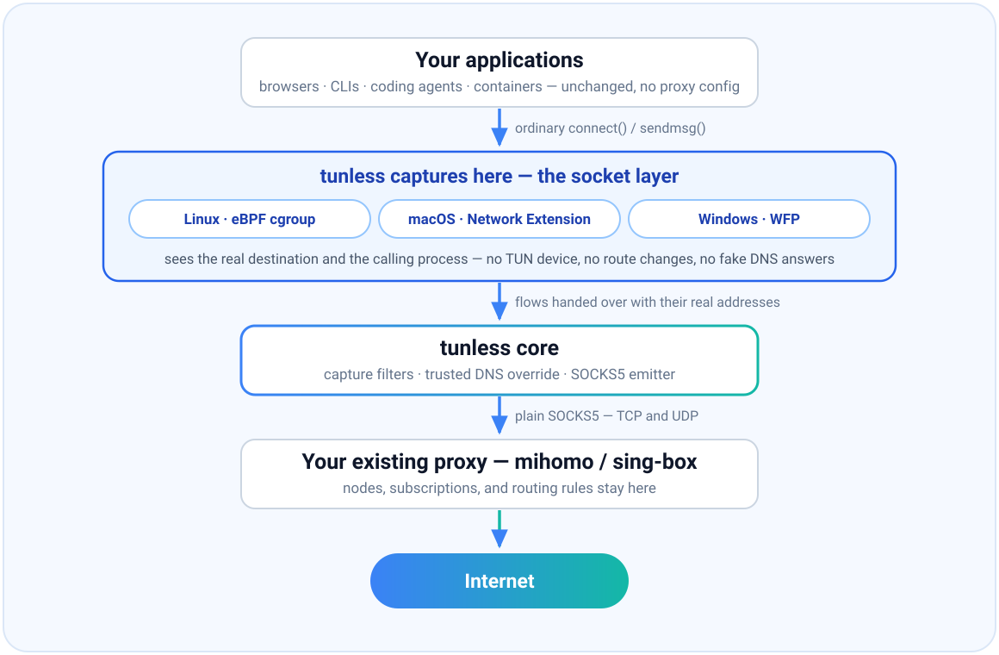

<p align="center">
  
</p>

<h1 align="center">tunless</h1>

<p align="center">
  <strong>TUN-less transparent proxying. No fake IP, no route hijack, no second TCP stack.</strong>
</p>

<p align="center">
  <a href="https://github.com/bojieli/tunless/actions/workflows/ci.yml"></a>
  <a href="LICENSE"></a>
</p>

`tunless` captures local TCP and UDP flows at the socket layer and hands them to
an ordinary SOCKS5 listener. Applications keep using normal sockets; your
existing mihomo or sing-box instance keeps its nodes, subscriptions, and routing
rules.

## Why tunless?

To make unmodified applications use a proxy today, you get two options — and
both have structural problems.

**TUN mode** captures packets, not sockets. To bridge packets back to
application-level rules, it has to fake things:

- **Forged DNS answers (fake IP)** — leaks into DoH-aware apps, caches,
  WebRTC, and logs, and needs `fake-ip-filter` exception lists to stop
  breaking things.
- **Trivially detectable** — fake answers come from a reserved range
  (`198.18.0.0/15`), so any application that inspects its own DNS (coding
  agents' SSRF guardrails, region checks) can tell it is being proxied; apps
  with their own resolver (DoH) bypass the mapping entirely.
- **SNI sniffing** — the second bridge from packets to hostnames, and ECH is
  removing it.
- **Global route hijack** — `auto-route` rewrites the routing table; a routing
  table entry has no owner, so a crash leaves your networking broken.
- **A second TCP/IP stack** in userspace, alongside the kernel's.

**Explicit HTTP/SOCKS proxy settings** only work if every application plays
along:

- **Support is opt-in per app** — environment variables like `HTTPS_PROXY`
  and the system proxy setting are just conventions; every application must
  implement and honor them itself.
- **Many applications don't** — plenty of tools never read proxy settings at
  all, so their traffic bypasses the proxy silently. This gap is the entire
  reason TUN mode exists.

`tunless` takes a third path: capture at the **socket layer**, where the
operating system still knows the real destination and the real process:

- **No fabricated DNS answers** — names resolve normally, to real addresses.
- **No route table mutation** — there is nothing to roll back after a crash.
- **No second TCP/IP stack** — flows stay on the kernel's own sockets.
- **Fail-open by construction** — capture state is owned by the kernel
  (unpinned `bpf_link`, dynamic WFP session, system-extension lifecycle); if
  `tunless` dies, new traffic goes direct. Tested with SIGKILL, not asserted.
- **Keep your proxy stack** — `tunless` only replaces the inbound; nodes,
  subscriptions, and rules stay in mihomo/sing-box.

The full design rationale is in [BLUEPRINT.md](BLUEPRINT.md).

## How it works

<p align="center">
  
</p>

Applications make ordinary socket calls. The capture point lives inside the
operating system's socket layer — eBPF cgroup hooks on Linux, a Network
Extension on macOS, WFP on Windows — so every flow keeps its real destination
and its calling process. `tunless` emits those flows as plain SOCKS5 to your
existing proxy, where nodes, subscriptions, and rules stay unchanged.

| Platform | Capture mechanism | Implementation status |
| --- | --- | --- |
| Linux | eBPF cgroup connect/sendmsg/recvmsg and sockops | Host and Docker namespace TCP plus connected UDP4/UDP6 and single-destination unconnected UDP4/UDP6; trusted DNS override is implemented in the shared SOCKS emitter |
| macOS | `NETransparentProxyProvider` system extension | Recorded notarized development builds pass live trusted-DNS redirection, SOCKS TCP/UDP, HTTP/1.x, HTTP/2, TLS, and concurrency tests, and capture stands aside on its own when the upstream stops resolving; exact-candidate clean-machine qualification remains open |
| Windows | WFP ALE connect-redirect callout | TCP and TCP DNS override source are implemented; WDK, fuzzing, runtime, and UDP DNS gates are unmet, and production driver signing is out of scope for this phase |

The three platforms ship at different maturities, and the first release says so
on its face: **Linux is generally available, macOS is beta, and Windows is
source only** — its driver is implemented but unqualified and unsigned, so it
is not a shippable artifact. See
[what the first release covers](docs/RELEASING.md#what-the-first-release-covers).

The portable core includes SOCKS5 TCP/UDP emission, HTTP CONNECT and SOCKS5
reference inbounds, destination/process capture filters, a real-answer DNS
observer, and two opt-in process-metadata transports.

Measured overhead is within **0.4% of direct throughput** (inside WAN
run-to-run spread), at roughly 2.8% of one core and ~9 MB RSS. Every number is
recorded with its host and date in
[measurements and release gates](docs/MEASUREMENTS.md) — demonstrated, not
assumed.

## Quick start (Linux)

Requirements: cgroup v2, kernel 5.7 or newer, and privileges to load and attach
BPF programs. The intended 5.10 floor and a current 6.8 kernel have both passed
the verifier and live runtime suite.

```console
make
sudo make install
sudo systemctl enable --now tunless
```

The installed unit reads `/etc/tunless.env` if present and defaults to:

```ini
TUNLESS_UPSTREAM=127.0.0.1:7890
TUNLESS_CGROUP=/sys/fs/cgroup/user.slice
TUNLESS_DNS_UPSTREAM=1.1.1.1:53
```

Packages install this optional environment file as root-owned mode `0600`
because an upstream URL may contain SOCKS credentials.

Run mihomo/sing-box as a system service outside `user.slice`. The `tunless`
unit itself runs in `system.slice`; this cgroup separation is loop avoidance,
not an exception list.

For an isolated scope or development test:

```console
sudo ./tunless --upstream 127.0.0.1:7890 \
  --backend linux --cgroup /sys/fs/cgroup/my-apps
```

Destination filters are evaluated in the BPF hook, so excluded flows stay
direct instead of being accepted and then dropped:

```console
sudo ./tunless --upstream 127.0.0.1:7890 \
  --cgroup /sys/fs/cgroup/my-apps \
  --include-destination 0.0.0.0/0 \
  --include-destination ::/0 \
  --exclude-destination 192.168.0.0/16 \
  --exclude-destination fc00::/7
```

Captured queries whose original destination port is 53 are sent to the numeric
`--dns-upstream` through SOCKS5 by default, with query IDs translated per
outstanding request. Use `--disable-dns-override` to retain each application's
original resolver.

### Containers and virtual machines

Containers need **no** TUN device, policy route, NAT rule, proxy environment
variable, or privileged process inside them. One command captures an existing
container:

```console
TUNLESS_UPSTREAM=127.0.0.1:7890 ./scripts/tunless-docker.sh my-dev-container
```

The same helper works on native Linux and macOS Docker Desktop; a PowerShell
equivalent covers Windows Docker Desktop. Watch-mode variants attach to Dev
Containers automatically, and rootful Podman, containerd, and CRI-O have their
own helpers. See [the container notes](docs/CONTAINERS.md).

### macOS and Windows

On macOS, notarized development builds of the `tunless` Network Extension and
its small launcher app have passed the recorded live tests, but the exact
release candidate still requires clean-machine qualification. Presets support
coexistence with Clash Verge, including one running its own TUN device.

Capture there is accountable for the network it takes over. It refuses to start
when the upstream cannot relay DNS, verifies resolution through the live
datapath afterwards, and then keeps re-proving it — standing aside so flows go
direct if the upstream stops resolving, and resuming when it recovers. The
addresses a host needs to stay reachable, and the two tunless itself relays
through, are reserved from capture whatever the configuration says. See
[deploying without losing the network](docs/MACOS.md#deploying-without-losing-the-network). On Windows, the WFP backend is implemented but
not yet release-qualified — treat it as source, not a shippable driver. Loading
a kernel driver on Windows 10 or later requires a Microsoft signature that this
project does not obtain in the current phase, so Windows builds are test-signed
only. Details:
[macOS notes](docs/MACOS.md) · [Windows notes](docs/WINDOWS.md).

## Migrate from mihomo TUN

Keep `mixed-port` and your rules. Delete the TUN block, DNS hijack, fake-IP pool,
and fake-IP filters. Current mihomo calls its real-answer mode `redir-host`.

```diff
 mixed-port: 7890
-tun:
-  enable: true
-  stack: mixed
-  auto-route: true
-  auto-redirect: true
-  auto-detect-interface: true
-  dns-hijack: ["any:53", "tcp://any:53"]
 dns:
   enable: true
-  enhanced-mode: fake-ip
-  fake-ip-range: 198.18.0.1/16
-  fake-ip-filter: [...]
+  enhanced-mode: redir-host
```

Then start the service with `TUNLESS_UPSTREAM=127.0.0.1:7890`. References:
mihomo [TUN](https://wiki.metacubex.one/config/inbound/tun/) and
[DNS](https://wiki.metacubex.one/en/config/dns/).

## Migrate from sing-box TUN

Remove the `tun` inbound and any `hijack-dns` rules used solely by it. Keep or
add a loopback `mixed` inbound for `tunless`:

```diff
 "inbounds": [
   {
-    "type": "tun",
-    "tag": "tun-in",
-    "address": ["172.18.0.1/30", "fdfe:dcba:9876::1/126"],
-    "auto_route": true,
-    "auto_redirect": true,
-    "strict_route": true,
-    "stack": "mixed"
+    "type": "mixed",
+    "tag": "tunless-in",
+    "listen": "127.0.0.1",
+    "listen_port": 7890,
+    "set_system_proxy": false
   }
 ]
```

Point `TUNLESS_UPSTREAM` at `127.0.0.1:7890`. References: sing-box
[TUN](https://sing-box.sagernet.org/configuration/inbound/tun/) and
[mixed inbound](https://sing-box.sagernet.org/configuration/inbound/mixed/).

Downstream `PROCESS-NAME` rules see `tunless`, not the original application.
Move capture-time process selection into the cgroup on Linux or signing-ID
filters on macOS. Destination, domain, node, and subscription rules remain
downstream.

Linux unconnected UDP associations are deliberately single-destination. A
second destination on the same socket fails with a permission error while the
association is active, instead of risking a reply with the wrong apparent
source; after the association closes, that socket may select a new destination.
Use a connected socket or separate sockets when destinations must overlap.
One edge case remains unsupported: simultaneous unconnected UDP6 sockets using
`SO_REUSEPORT` to share the exact source endpoint are ambiguous at the redirect
listener. Avoid shared-source `SO_REUSEPORT` for captured UDP6 workloads.

## Project status

The repository is preparing an unpublished candidate; **no public release has
been made**. Reviewable packages, SBOMs, checksums, and OCI output are built
only by the manual non-publishing workflow described in
[the release process](docs/RELEASING.md), and the evidence for each release
gate — including the gates not yet demonstrated — is recorded in
[docs/MEASUREMENTS.md](docs/MEASUREMENTS.md).

## Documentation

| Document | Contents |
| --- | --- |
| [BLUEPRINT.md](BLUEPRINT.md) | Design of record: the thesis, the faults in TUN mode, rejected alternatives |
| [docs/CONTAINERS.md](docs/CONTAINERS.md) | Docker, Podman, containerd/CRI-O, Docker Desktop, VMs |
| [docs/MACOS.md](docs/MACOS.md) | Network Extension build, signing, Clash Verge preset, recovery |
| [docs/WINDOWS.md](docs/WINDOWS.md) | WFP driver design, build, and release gates |
| [docs/OPERATIONS.md](docs/OPERATIONS.md) | Preflight checks, health API, capacity, DNS override, metadata, recovery |
| [docs/MEASUREMENTS.md](docs/MEASUREMENTS.md) | Dated performance and gate evidence, including what is not demonstrated |
| [docs/THREAT_MODEL.md](docs/THREAT_MODEL.md) | Assets, trust boundaries, risks, and explicit non-goals |
| [docs/RELEASING.md](docs/RELEASING.md) · [docs/RELEASE_CHECKLIST.md](docs/RELEASE_CHECKLIST.md) | Release procedure and review gates (maintainers) |

## Contributing

Contributions are welcome — see [CONTRIBUTING.md](CONTRIBUTING.md) for the
development setup (`go test -race ./...`, `go vet`, `swift test`, privileged
integration suites) and review expectations. Security reports should follow
[SECURITY.md](SECURITY.md).

`tunless` is local socket capture, not an IP-forwarding proxy: it does not
intercept transit traffic from other machines, raw ICMP, ESP, GRE, or arbitrary
IP protocols, and it is not a VPN, rule engine, proxy protocol collection, GUI,
or mobile backend.

MIT licensed.
